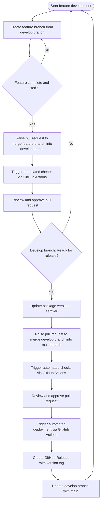

# Branching and deployment guide

## Overview

Our branching strategy is designed to support Continuous Integration and Continuous Deployment (CI/CD),
ensuring smooth transitions between development, testing and production.

This framework aims to maintain a stable codebase and streamline our workflow and collaboration, making
it easier to integrate new features, fix bugs and release updates promptly.
It does this by separating in-progress work from production-ready content and using [semantic versioning][sem-ver]
to provide clarity regarding update content.

## Branches

Our repository has two permanent branches:

- **`main`** - stable codebase reflecting the current production state. Only pull requests from `develop` or
  `hotfix` branches are accepted.
- **`develop`** - active development branch containing new features, bug fixes and improvements. All feature
  branch pull requests, except `hotfix` branches, should be made here.

## Development workflow

1. **Feature branches:**
  - All new features and bugfixes are developed in separate branches created from the `develop` branch.
  - Any hotfixes are developed in separate branches created from the `main` branch.
  - Branch naming conventions:
    -`docs/<documentation-description>` - for updates to documentation only.
    - `feat/<feature-description>` - feature branches, for introducing new features.
    - `fix/<bug-description>` - bugfixes, for resolving bugs.
    - `hotfix/<issue-description>` - hotfixes, for urgent fixes that go straight to production.
  - [Conventional commit][commits] messages, including the following types:
    - `build` - for changes that affect the build system or external dependencies.
    - `ci` - for changes to CI configuration files and scripts, e.g. GitHub Actions, Dependabot.
    - `docs` - for documentation-only changes.
    - `feat` - for new features.
    - `fix` - for bugfixes and hotfixes.
    - `perf` - for changes that improve performance only.
    - `refactor` - for code changes that neither add a feature, fix a bug nor improve performance.
    - `style` - for changes that do not affect code meaning (e.g. removing whitespace, standardising quote type).
    - `test` - for changes that add missing tests or correct existing tests.

2. **Merging to development:**
   - Once a feature is complete and tested, it is merged into the `develop` branch via a pull request.
   - Pull requests must undergo peer review.
   - Approval for the most recent commit on the branch must be given by the peer reviewer prior to merge.
   - Remember to update the changelog.

3. **Version bumping:**
   - Before merging `develop` into `main`, update the package version following [semantic versioning principles][sem-ver].
   - Use `bump2version` to bump the `scalelink` package version. E.g. `bump2version patch` for a patch update,
     `bump2version minor` for a minor update or `bump2version major` for a major update.
   - Remember to update the changelog.

4. **Merging to main:**
   - After a set of features is finalised in the `develop` branch and the package version is bumped, merge `develop`
     into `main`.
   - This action triggers the automated deployment process through GitHub Actions.

5. **Post-merge update:**
   - After merging into `main`, update the `develop` branch with the latest `main` branch changes using `git pull`.
     This ensures the `develop` branch is aligned with production.

## Pull request process using GitHub Actions

### Overview

[GitHub Actions][github-actions] are triggered on pull request from any branch, including feature branches. This CI/CD pipeline
ensures code does not enter the `develop` or `main` branches unless it has had certain checks. The repository is set up so
that pull requests cannot be merged if these GitHub Actions fail.

### Steps in the pull request pipeline

1. **Trigger:**
   - The pipeline is triggered when a `merge` is detected.

2. **Changelog check:**
   - The changelog is checked for updates.

3. **Pre-commit hooks:**
   - All pre-commit hooks are run.

4. **Unit tests:**
   - All unit tests are run.

## Deployment process using GitHub Actions

### Overview

The deployment process is automated using [GitHub Actions][github-actions]. This CI/CD pipeline is triggered upon merging
changes into the `main` branch.

### Steps in the deployment pipeline

1. **Trigger:**
   - The pipeline is triggered when a `merge` into `main` is detected.

2. **Increment version:**
   - The version of the package is incremented.
   - The new version tag is pushed.
  
Further deployment steps will be added in due course.

## Merging develop to main: A guide for maintainers

As `scalelink` maintainers, ensuring a seamless transition from `develop` to `main` branch is essential. This process extends beyond mere code managing: it encompasses careful preparation, version management and detailed documentation to preserve the codebase's integrity and reliability. Below is a straightforward guide on the procedure.

### Preparation

- **Initiate merge request:**
  - Navigate to the GitHub repository's page and access the "Pull Requests" section.
  - Click on "New Pull Request" to start the merging process. Select the `develop` branch as the source and the `main` branch as the target.
  - Title the merge request with a relevant name that succinctly describes the set of features, fixes or improvements being merged. Example: "Release 1.2.0: Feature Enhancements and Bug Fixes".

### Review and approval

- **Review changes:**
  - Utilise GitHub's User Interface (UI) to review the changes introduced. This is critical for spotting any potential issues before they make it into `main` branch.
  - Cross-reference the changes against the `CHANGELOG.md` file to ensure all updates, fixes and new features are properly documented.
  - Ensure all checks via GitHub Actions pass.

- **Approve changes:**
  - Once satisfied with the review, click on the "Review changes" button in GitHub and select "Approve" from the options. This indicates that the changes have been reviewed and are considered ready for merging. If you're reviewing multiple files, click on the "Viewed" checkbox for each file as you review them. This helps manage and streamline the review process by marking files that have already been checked.

### Version management and documentation

- **Bump version:**
  - Before merging, it's essential to update the package version. Use the `bump2version` command line tool to increment the version according to the nature of the changes (patch, minor or major). For example, run `bump2version patch` for a patch update in your local development environment.

- **Update `CHANGELOG.md`:**
  - In the `CHANGELOG.md` file, create a new header/section for the newly bumped version.
  - Move all entries from the "Unreleased" section to the new version section. This action effectively transfers the documentation of changes from being pending release to being part of the new version's official changelog.
  - Ensure the "Unreleased" section is left empty after this process, ready for documenting future changes.

- **Update `CHANGELOG.md` release links:**
  - After bumping the version and updating the `CHANGELOG.md` with the new version header and changes, proceed to update the "Release links" section at the bottom of the document. Add links to the new version's GitHub Release page and its PyPi listing, following the existing format. **Note: this repo does not currently have a PyPi listing.**
    This step ensures users and developers can easily find and access the specific versions of `scalelink` through their respective release pages and download links, maintaining comprehensive and navigable documentation.

- **Final review and push:**
 - Review the changes one more time, ensuring that the version bump and `CHANGELOG.md` updates are correctly applied.
 - Push the commit(s) to the `develop` branch. This action updates the branch with the version change and changelog updates.

### Merging and deployment

- **Merge to main:**
  - With all preparations complete and changes reviewed, proceed to merge the `develop` branch into the `main` branch.
  - This action can be done through the GitHub UI by completing the pull request initiated in the Preparation section of this guide.
  - Merging to `main` automatically triggers the GitHub Actions workflow for deployment. **Note: this currently only includes creating a GitHub Release with the new version tag.**

### Synchronising develop branch post-merge

After the pull request from `develop` to `main` has merged, it is crucial to synchronise the `develop` branch with the changes in `main`. Perform the following steps to ensure that `develop` stays up-to-date:

- **Pull changes from main:**
  - Execute `git pull origin main` to fetch and merge the latest changes from the `main` branch to your current feature branch.
  - If you are currently working on more than one feature branch, use `git checkout <my-feature-branch>` to switch to your next feature branch. Then, execute `git pull origin main` to fetch and merge the latest changes from the `main` branch to it. Repeat this until all of your current feature branches have been updated.
 
- **Switch to develop branch:**
  - Use `git checkout develop` to switch from your current feature branch to the `develop` branch.
 
- **Merge main into develop:**
  - Run `git merge main` whilst on the `develop` branch to merge the changes from the `main` branch into `develop`.
 
- **Push updated develop:**
  - After merging, push the updated `develop` branch back to the remote repository using `git push origin develop`.

By adhering to these steps, you'll make the transition from development to production smooth and efficient, ensuring the codebase remains stable and the release process flows seamlessly. As maintainers, your pivotal role guarantees the `scalelink` package's reliability and efficiency for all users.

## Git workflow diagram

Below is a visual representation of our Git workflow, illustrating the process from feature development through to deployment.

[commits]: https://www.markdownguide.org/basic-syntax/#links
[sem-ver]: https://semver.org/
[github-actions]: https://github.com/features/actions
