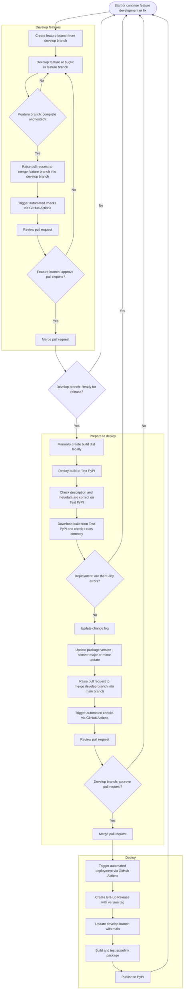

# Branching and deployment guide

## Overview

Our branching strategy is designed to support Continuous Integration and Continuous Deployment (CI/CD),
ensuring smooth transitions between development, testing and production.

This framework aims to maintain a stable codebase and streamline our workflow and collaboration, making
it easier to integrate new features, fix bugs and release updates promptly.
It does this by separating in-progress work from production-ready content and using [semantic versioning][sem-ver]
to provide clarity regarding update content.

## Branches

Our repository has two permanent branches:

- **`main`** - stable codebase reflecting the current production state. Only pull requests from the `develop`
  branch are accepted.
- **`develop`** - active development branch containing new features, bug fixes and improvements. All feature
  branch and fix branch pull requests should merge to here.

## Development workflow

1.  **Feature branches:**
    - All new features and fixes are developed in separate branches created from the `develop` branch.
    - [Conventional branch][branches] naming conventions:
    - `feat/<feature-description>` - feature branches, for introducing new features.
        - `fix/<bug-description>` - bugfixes or hotfixes, for resolving bugs (we aim for `develop` to always be
          release-ready, so a separate system for rapidly integrating hotfixes is not required).
    - [Conventional commit][commits] messages, including the following types:
        - `build` - for changes that affect the build system or external dependencies.
        - `ci` - for changes to CI configuration files and scripts, e.g. GitHub Actions, Dependabot.
        - `docs` - for documentation-only changes.
        - `feat` - for new features.
        - `fix` - for bugfixes and hotfixes.
        - `perf` - for changes that improve performance only.
        - `refactor` - for code changes that neither add a feature, fix a bug nor improve performance.
        - `style` - for changes that do not affect code meaning (e.g. removing whitespace, standardising quote type).
        - `test` - for changes that add missing tests or correct existing tests.

2.  **Merging to development:**
    - Once a feature is complete and tested, it is merged into the `develop` branch via a pull request.
    - Pull requests must undergo peer review.
    - Approval for the most recent commit on the branch must be given by the peer reviewer prior to merge.
    - Remember to update the changelog.

3.  **Tagging:**
    - Once these updates merged to `develop`, tag them as follows:
        - Pull updates from the `develop` branch locally.
        - Tag the latest commit on the `develop` branch using `git tag <version number dev>`, e.g.
          `git tag 1.0.0-dev`.
        - Push the tag remotely using `git push origin <version number dev>`, e.g. `git push origin 1.0.0-dev`.

4.  **Build and deployment testing:**
    - Test the build and deployment of the new package as follows:
        - In GitHub, navigate to the "Actions" page of the `scalelink` repository.
        - Navigate to the "Deploy version to Test PyPI" workflow, using the menu on the left-hand side of the window.
        - Click on the "Run workflow" button on the right of the page.
        - Ensure the "Use workflow from" option has "Branch: develop" selected.
        - Enter the develop tag name, e.g. `1.0.0-dev`, into the "Version to deploy" box.
        - Click on the "Run workflow" button.
    - If the workflow runs successfully, move on to the next step.
    - If the workflow fails, fix it in a separate branch that is merged into the `develop` branch when working.
        - Note: you can test deployments to Test PyPI from this fix branch by following the above instructions but
          changing the "Use workflow from" option from "Branch: develop" to the fix branch.

5.  **Version bumping:**
    - Once deployment from `develop` to Test PyPI is successful, bump the version by making a feature branch containing
      the following changes:
        - Update the package version in `pyproject.toml`, following [semantic versioning principles][sem-ver].
        - Update the changelog. Move the "Unreleased" changes into a new section for this version and
          create a new, empty "Unreleased" changes section.
    - Raise a pull request for this branch to `develop`.
    - This pull request, like all pull requests in this repository, must undergo peer review. However, this should
      be able to be light-touch.

6.  **Merging to main:**
    - Once the version on `develop` is successfully bumped, raise a pull request to merge `develop` to `main`.
    - Peer review should be light-touch and mainly focused on confirming:
        - Version bumping.
        - Evidence of successful Test PyPI deployment.
    - Once these updates merged to `main`, tag them as follows:
        - Pull updates from the `main` branch locally.
        - Tag the latest commit on the `main` branch using `git tag <version number>`, e.g. `git tag 1.0.0`.
        - Push the tag remotely using `git push origin <version number>`, e.g. `git push origin 1.0.0`.

6.  **Deployment to PyPI:**
    - The PyPI deployment workflow is currently also manually triggered. To deploy:
        - In GitHub, navigate to the "Actions" page of the `scalelink` repository.
        - Navigate to the "Deploy version to PyPI" workflow, using the menu on the left-hand side of the window.
        - Click on the "Run workflow" button on the right of the page.
        - Update the "Use workflow from" option to "Branch: main".
        - Enter the tag name, e.g. `1.0.0`, into the "Version to deploy" box.
        - Click on the "Run workflow" button.
   - If the workflow runs successfully, move on to the next step.
   - If the workflow fails, fix it in a separate branch that is merged into the `develop` branch when working,
     then merge `develop` to `main`, re-tag the latest commit in `main` as a new patch version and re-attempt
     this step.

7. **Post-merge update:**
   - After merging into `main`, update the `develop` branch with the latest `main` branch changes using `git rebase`.
     This ensures the `develop` branch is aligned with `main` and is ready to receive new merges ahead of creating
     a new version.
   - After this, all developers must update their currently open feature branches by rebasing to `develop`. This
     prevents conflicts when these branches come to be merged.

## Git workflow diagram

Below is a visual representation of our Git workflow, illustrating the process from feature development through to deployment.

```mermaid
graph TD
    Start1([Start or continue feature development or fix])

    Feat1[Create feature branch from develop branch]
    Feat2[Develop feature or bugfix in feature branch]
    Feat3{Feature branch: complete and tested?}
    Feat4[Raise pull request to merge feature branch into develop branch]
    Feat5[Trigger automated checks via GitHub Actions]
    Feat6[Review pull request]
    Feat7{Feature branch: approve pull request?}
    Feat8[Merge pull request]

    Dev1{Develop branch: Ready for release?}
    Dev2[Manually create build dist locally]
    Dev3[Deploy build to Test PyPI]
    Dev4[Check description and metadata are correct on Test PyPI]
    Dev5[Download build from Test PyPI and check it runs correctly]
    Dev6{Deployment: are there any errors?}
    Dev7[Update change log]
    Dev8[Update package version - semver major or minor update]
    Dev9[Raise pull request to merge develop branch into main branch]
    Dev10[Trigger automated checks via GitHub Actions]
    Dev11[Review pull request]
    Dev12{Develop branch: approve pull request?}
    Dev13[Merge pull request]

    Deploy1[Trigger automated deployment via GitHub Actions]
    Deploy2[Create GitHub Release with version tag]
    Deploy3[Update develop branch with main]
    Deploy4[Build and test scalelink package]
    Deploy5[Publish to PyPI]

    subgraph sg3 [Develop features]
      Feat1 --> Feat2
      Feat2 --> Feat3
      Feat3 -- No --> Feat2
      Feat3 -- Yes --> Feat4
      Feat4 --> Feat5
      Feat5 --> Feat6
      Feat6 --> Feat7
      Feat7 -- No --> Feat2
      Feat7 -- Yes ---> Feat8
    end

    subgraph sg2 [Prepare to deploy]
      Dev2 --> Dev3
      Dev3 --> Dev4
      Dev4 --> Dev5
      Dev5 --> Dev6
      Dev6 -- No --> Dev7
      Dev7 --> Dev8
      Dev8 --> Dev9
      Dev9 --> Dev10
      Dev10 --> Dev11
      Dev11 --> Dev12
      Dev12 -- Yes --> Dev13
    end

    subgraph sg1 [Deploy]
      Deploy1 --> Deploy2
      Deploy2 --> Deploy3
      Deploy3 --> Deploy4
      Deploy4 --> Deploy5
    end

    Deploy5 --> Start1
    Dev1 -- No --> Start1
    Dev1 -- Yes --> Dev2
    Dev6 -- Yes --> Start1
    Dev12 -- No --> Start1
    Dev13 --> Deploy1
    Start1 --> Feat1
    Feat8 --> Dev1
```

## Overview of GitHub Actions

CI/CD in this repository is implemented using [GitHub Actions][github-actions].

### Pull request workflow

The following workflow is triggered on pull request to any branch. This ensures code does not enter any parent
branches unless it is permitted to and has passed certain checks.

1.  **Trigger:**
    - When a pull request is detected that is opened, synchronised, reopened, ready for review, unlabelled or labelled.

2.  **Check branch job:**
    - Checks the base branch for the pull request.
    - If the base branch is `main`, checks if the branch is `develop`. If it is not, returns an error.
    - This prevents merges to `main` from branches other than `develop`.

3.  **Changelog job:**
    - Checks that `CHANGELOG.md` has been updated.
    - This prompts the developer to update the change log if they have forgotten.

4.  **Pre-commit job:**
    - Runs all pre-commit hooks.
    - This protects against developers who, for whatever reason, do not have the pre-commit hooks turned on locally.

5.  **Test:**
    - Run all unit tests on all versions of Python supported by the repo.
    - This ensures all unit tests, both new and existing, pass.

### Deploy to Test PyPI workflow

The following workflow is triggered manually. It deploys the specified tagged commit on the specified branch to
Test PyPI, allowing testing of package deployment ahead of releasing a new version to PyPI.

1.  **Trigger:**
    - Manual, via the "Actions" page in GitHub.
    - Requires the version to deploy to be specified, e.g. `1.0.0-dev`.

2.  **Release build job:**
    - Checks out the repository.
    - Uses `hynek/build-and-inspect-python-package` to:
        - Build the package.
        - Upload the built wheel and the source distribution as GitHub Actions artefacts.
        - Lint the wheel contents using `check-wheel-contents`.
        - Lint the PyPI README using `Twine` and upload it as a GitHub Actions artefact.
        - Attest the build provenance.
        - Print the tree of both SDist and `wheel`, allowing manual checking of the content list.
        - Print and upload the packaging metadata as a GitHub Actions artefact.

3.  **Release publish job:**
    - Retrieves the distribution produced by the previous job.
    - Publishes it to Test PyPI, using Trusted Publishing.

### Deploy to PyPI workflow

The following workflow is triggered manually. It deploys the specified tagged commit on the specified branch
(which should be `main`) to PyPI, thus releasing a new version of the `scalelink` package.

1.  **Trigger:**
    - Manual, via the "Actions" page in GitHub.
    - Requires the version to deploy to be specified, e.g. `1.0.0`.

2.  **Release build job:**
    - Checks out the repository.
    - Uses `hynek/build-and-inspect-python-package` to:
        - Build the package.
        - Upload the built wheel and the source distribution as GitHub Actions artefacts.
        - Lint the wheel contents using `check-wheel-contents`.
        - Lint the PyPI README using `Twine` and upload it as a GitHub Actions artefact.
        - Attest the build provenance.
        - Print the tree of both SDist and `wheel`, allowing manual checking of the content list.
        - Print and upload the packaging metadata as a GitHub Actions artefact.

3.  **Release publish job:**
    - Retrieves the distribution produced by the previous job.
    - Publishes it to PyPI, using Trusted Publishing.

### Increment version workflow

This workflow is not currently used. It has been retained to provide a starting point for developing
automated version incrementation and deployment in the future.

[branches]: https://conventional-branch.github.io/
[check-wheel-contents]: https://pypi.org/project/check-wheel-contents/
[commits]: https://www.markdownguide.org/basic-syntax/#links
[github-actions]: https://github.com/features/actions
[sem-ver]: https://semver.org/
[twine]: https://twine.readthedocs.io/en/stable/
